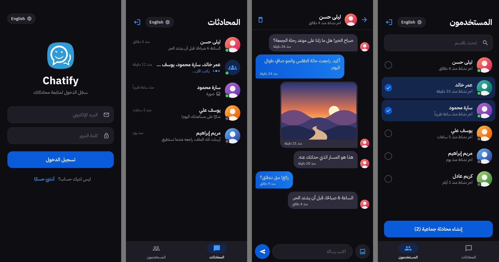
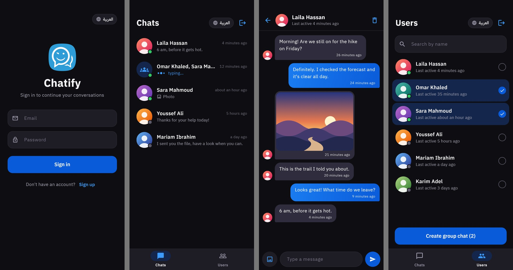

# Chatify — Realtime Chat App

A realtime chat app built with **Flutter + Firebase**: one-to-one and group chats with text and image messages, in Arabic and English.

## Features

- 🔐 **Accounts** — register with a name, email, password and profile photo; sign in and out (Firebase Auth)
- 👥 **Users** — everyone else who has registered, with a green dot for anyone who opened the app in the last two hours and a "last active" time; search by the first letters of a name (case-sensitive)
- 💬 **Chats** — pick one user for a one-to-one chat, or several for a group chat
- ⚡ **Realtime messages** — text and image messages arrive live through Cloud Firestore streams, each with a relative time (`timeago`)
- 🖼️ **Images** — profile photos and image messages are uploaded to **Cloudinary** and shown from their URL
- ✍️ **Typing indicator** — the chats list marks a chat while one of its members has the keyboard open in it
- 🗑️ **Delete chat** — removes the chat for all of its members, after a confirmation
- 🌍 **Arabic (RTL) and English** (`easy_localization`) — Arabic by default, switchable from the login screen and from the Chats and Users tabs
- 🌙 Dark UI with one shared theme, plus loading, empty and error states

## Screenshots

| Arabic | English |
|---|---|
|  |  |

Rendered from the real screens with sample data by `tool/screens_golden_test.dart`.
Firebase cannot run in a widget test, so the users, chats and messages are sample data that lives only in that test, and the profile pictures and the photo are drawn by the test itself.

## Architecture

**Provider**-based MVVM with a dedicated services layer, and **get_it** for service location:

```
lib/
├── models/       # chat, message, user
├── pages/        # splash, login, register, home, chats, chat, users
├── providers/    # authentication, chats list, single chat, users
├── services/     # database (Firestore), cloud storage (Cloudinary), media, navigation
├── themes/       # colours and ThemeData
└── widgets/      # message bubbles, list tiles, inputs, top bar, shared widgets
assets/translations/   # ar.json, en.json
```

Firestore holds two collections: `Users` (name, email, image, last_active) and `Chats` (members, is_group, is_activity), each chat with a `messages` subcollection (sender_id, type, content, sent_time).

## Getting Started

```bash
flutter pub get
flutter run
```

Before the first run:

- **Firebase** — create a project with Email/Password authentication and Cloud Firestore, then add your own `android/app/google-services.json` and `ios/Runner/GoogleService-Info.plist`. The app starts Firebase from these native files.
- **Cloudinary** — create an unsigned upload preset and put a `.env` file in the project root with these keys:

  ```
  CLOUD_NAME=
  UPLOAD_PRESET=
  API_KEY=
  API_SECRET=
  ```

  The upload only uses `CLOUD_NAME` and `UPLOAD_PRESET`. `API_KEY` and `API_SECRET` are read but never used, and `.env` is bundled into the app as an asset, so leave those two empty.

To re-render the screenshots (PNGs land in `tool/shots/`):

```bash
flutter test --update-goldens tool/screens_golden_test.dart
```

## 📦 Packages

| Package | Version |
|---|---|
| `firebase_core` | ^3.13.0 |
| `firebase_analytics` | ^11.3.6 |
| `firebase_storage` | ^12.3.6 |
| `firebase_auth` | ^5.3.3 |
| `cloud_firestore` | ^5.5.0 |
| `provider` | ^6.1.2 |
| `get_it` | ^8.0.2 |
| `file_picker` | ^8.1.4 |
| `flutter_spinkit` | ^5.2.1 |
| `get_time_ago` | ^2.1.1 |
| `flutter_keyboard_visibility` | ^6.0.0 |
| `flutter_dotenv` | ^5.2.1 |
| `timeago` | ^3.7.0 |
| `easy_localization` | ^3.0.8 |
| `cupertino_icons` | ^1.0.8 |
| `http` | ^1.3.0 |
| `mime` | ^2.0.0 |
| `http_parser` | ^4.0.2 |

`firebase_analytics`, `firebase_storage` and `get_time_ago` are declared in `pubspec.yaml` but not used by the code.

